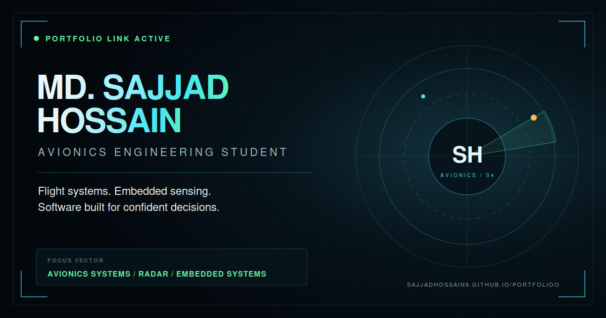

# Md. Sajjad Hossain - Engineering & Software Portfolio

[](https://github.com/Sajjadhossain9/portfolioo/actions/workflows/deploy.yml)
[](https://sajjadhossain9.github.io/portfolioo/)



An interactive mission-control portfolio for **Md. Sajjad Hossain**, an avionics engineering student and full-stack web developer working across electronics, embedded systems, circuit design and practical software interfaces.

## Mission brief

The site turns a traditional engineering CV into an interactive technical narrative. It combines a responsive aerospace HUD visual system with project dossiers, engineering experience, software capabilities and a privacy-safe downloadable CV.

## Highlights

- Animated avionics radar identity display
- CV-based profile, technical systems and field log
- Interactive rocket, engine-monitoring, radar and drone mission dossiers
- Full-stack development, embedded systems and avionics capabilities
- Responsive navigation and mobile layouts
- Reduced-motion support and keyboard accessibility
- Privacy-safe two-page public CV
- Open Graph image, favicon, manifest, sitemap and structured SEO data
- Automated GitHub Pages deployment

## Technology

- React 19
- Vite 8
- Modern CSS animations and responsive layouts
- GitHub Actions
- GitHub Pages

## Local development

Requirements: Node.js 20.19+ or 22.12+.

```bash
git clone https://github.com/Sajjadhossain9/portfolioo.git
cd portfolioo
npm ci
npm run dev
```

Create a production build:

```bash
npm run build
npm run preview
```

## Project structure

```text
portfolioo/
├── .github/workflows/deploy.yml   # GitHub Pages pipeline
├── public/                        # CV, social preview and SEO assets
├── src/App.jsx                    # Portfolio content and interactions
├── src/FlightScene.jsx            # Interactive 3D avionics visual
├── src/components/                # Reusable header and footer
├── src/index.css                  # Visual system and responsive layout
├── index.html                     # Metadata and structured data
└── vite.config.js                 # GitHub Pages base path
```

## Content update map

| Update | File |
|---|---|
| Profile, mission and experience text | `src/App.jsx` |
| Skills, missions and professional profile | `src/App.jsx` |
| Colors, motion and responsive styles | `src/index.css` |
| Search and social metadata | `index.html` |
| Public CV | `public/Sajjad-Hossain-CV-Redacted.pdf` |
| Social preview | `public/og-image.svg` and `public/og-image.png` |
| Sitemap date | `public/sitemap.xml` |

## Deployment

Every push to `main` runs the GitHub Actions workflow, builds the Vite application and deploys the `dist` directory to GitHub Pages.

Live URL: <https://sajjadhossain9.github.io/portfolioo/>

## Privacy

The downloadable public CV was rebuilt without a phone number or professional reference details. Private contact information should not be added to public repository files without reviewing the rendered PDF and its extractable text.

## Connect

- [GitHub](https://github.com/Sajjadhossain9)
- [LinkedIn](https://www.linkedin.com/in/sajjad-hossain-369929299/)
- [Facebook](https://www.facebook.com/profile.php?id=61578672953767)
